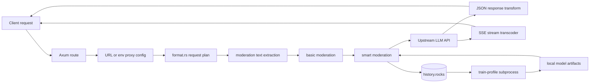

# PrismGuard Rust

<p align="center">
  <strong>AI API gateway for protocol translation, inline moderation, streaming parity, and local moderation training.</strong>
</p>

<p align="center">
  <a href="https://github.com/CassiopeiaCode/PrismGuard/actions/workflows/tests.yml"></a>
  <a href="https://github.com/CassiopeiaCode/PrismGuard/actions/workflows/ghcr.yml"></a>
  <a href="https://github.com/CassiopeiaCode/PrismGuard/pkgs/container/prismguard"></a>
  <a href="https://github.com/CassiopeiaCode/PrismGuard/releases"></a>
  <a href="https://github.com/CassiopeiaCode/PrismGuard"></a>
  <a href="LICENSE"></a>
</p>

<p align="center">
  <a href="Cargo.toml"></a>
  <a href="Dockerfile"></a>
  <a href="Dockerfile"></a>
  <a href="Cargo.toml"></a>
  <a href="Cargo.toml"></a>
  <a href="src/format.rs"></a>
  <a href="src/streaming.rs"></a>
  <a href="src/moderation"></a>
  <a href="src/training.rs"></a>
  <a href="tests"></a>
</p>

PrismGuard Rust is an AI API moderation gateway. It sits between clients and upstream LLM APIs, understands multiple request/response protocols, applies moderation before the upstream call, can transcode streaming SSE responses, and optionally persists moderation history for local model training.

It is built for production proxy work, not only raw forwarding. The codebase keeps protocol behavior explicit across HTTP routing, request format detection, JSON response conversion, SSE event conversion, moderation error envelopes, history reuse, and training scheduling.

## Highlights

- **Protocol bridge:** OpenAI Chat Completions, OpenAI Responses, Claude Messages, and Gemini GenerateContent request families.
- **Streaming parity:** SSE decoding and re-emission with text deltas, tool-call deltas, final events, usage metadata, and single `[DONE]` handling.
- **Inline moderation:** keyword moderation plus smart moderation with cache/history reuse, local model decisions, LLM fallback, retry logic, and concurrency limiting.
- **Local runtimes:** `hashlinear`, `bow`, and `fasttext` moderation paths selected per profile.
- **Training loop:** profile-aware sample RPC, training subprocess mode, cooldown decisions, and scheduler support.
- **Debug surface:** health, OpenAPI stub, URL config parsing, profile inspection, model metrics, and storage inspection routes.

## Contents

- [Install](#install)
- [How It Works](#how-it-works)
- [Supported Protocols](#supported-protocols)
- [Quick Start](#quick-start)
- [Publishing](#publishing)
- [Proxy Configuration](#proxy-configuration)
- [Moderation Profiles](#moderation-profiles)
- [Runtime Features](#runtime-features)
- [HTTP Endpoints](#http-endpoints)
- [Testing](#testing)
- [Repository Map](#repository-map)
- [Operational Notes](#operational-notes)
- [Acknowledgements](#acknowledgements)
- [License](#license)

## Install

### Container Image from GHCR

The default image is published to GitHub Container Registry:

```bash
docker pull ghcr.io/cassiopeiacode/prismguard:latest
docker run --rm -p 8000:8000 --env-file .env ghcr.io/cassiopeiacode/prismguard:latest
```

Common tags:

| Tag | Meaning |
| --- | --- |
| `latest` | Latest successful build from the default branch. |
| `master` | Latest successful build from `master`. |
| `sha-<commit>` | Immutable image for a specific commit. |
| `<version>` | Release image from a `v*` Git tag, for example `1.2.3`. |

Package page:

```text
https://github.com/CassiopeiaCode/PrismGuard/pkgs/container/prismguard
```

### Precompiled Binary from GitHub Releases

Tagged releases publish a Linux amd64 binary and checksum:

```bash
gh release download --repo CassiopeiaCode/PrismGuard --pattern 'Prismguand-Rust-linux-amd64.tar.gz'
gh release download --repo CassiopeiaCode/PrismGuard --pattern 'Prismguand-Rust-linux-amd64.tar.gz.sha256'
sha256sum -c Prismguand-Rust-linux-amd64.tar.gz.sha256
tar -xzf Prismguand-Rust-linux-amd64.tar.gz
chmod +x Prismguand-Rust-linux-amd64
./Prismguand-Rust-linux-amd64
```

Release page:

```text
https://github.com/CassiopeiaCode/PrismGuard/releases
```

### Build from Source

```bash
git clone https://github.com/CassiopeiaCode/PrismGuard.git
cd PrismGuard
cargo build --release
./target/release/Prismguand-Rust
```

## How It Works



Request flow:

1. The catch-all proxy route receives a request whose path contains `{config}${upstream}` or `!ENV_KEY${upstream}`.
2. `src/routes.rs` parses the proxy configuration and real upstream URL.
3. `src/format.rs` optionally detects and transforms the request into a target API format.
4. `src/moderation/extract.rs` derives the text that should be reviewed.
5. `basic_moderation` can block immediately from keywords.
6. `smart_moderation` can reuse history, run a local model, or call an LLM reviewer.
7. `src/proxy.rs` forwards the request to the upstream API only after moderation passes.
8. `src/response.rs` transforms non-stream JSON responses when needed.
9. `src/streaming.rs` transcodes SSE streams when the source and target protocols differ.

## Supported Protocols

`format_transform` supports these request format names:

| Format name | API family |
| --- | --- |
| `openai_chat` | OpenAI-compatible Chat Completions |
| `openai_responses` | OpenAI-compatible Responses API |
| `claude_chat` | Anthropic Claude Messages |
| `gemini_chat` | Gemini GenerateContent |

The transformation layer handles normal messages, system/instruction fields, multimodal content blocks, tool declarations, tool calls, tool results, stream flags, and path rewrites for target APIs. The response layer includes both JSON conversion and SSE conversion paths, with the broadest coverage in the HTTP proxy and stream tests.

## Quick Start

### Requirements

- Linux or another Unix-like environment.
- Rust toolchain compatible with edition 2021. The Dockerfile currently installs Rust `1.89.0`.
- `clang` and `libclang` when building dependencies that need native compilation.
- Optional: `systemd-run` and CPU affinity tools for the scheduler-style workflows.

### Run Locally

```bash
cd /services/llms/moderation/Prismguand-Rust
cargo run
```

By default the service reads `.env` from the repository root, listens on `0.0.0.0:8000`, and exposes:

```bash
curl -s http://127.0.0.1:8000/healthz
```

Expected shape:

```json
{
  "ok": true,
  "service": "PrismGuard",
  "host": "0.0.0.0",
  "port": 8000,
  "debug": true
}
```

### Build a Release Binary

```bash
cargo build --release
./target/release/Prismguand-Rust
```

The bundled `start.sh` expects a `.env` file and a release binary:

```bash
nice -n 19 cargo build --release -j 1
./start.sh
```

### Docker Build

```bash
docker build -t prismguard-rust .
docker run --rm -p 8080:8080 prismguard-rust
```

The Docker image builds the default feature set. Storage debug routes and sample RPC service code require the explicit `storage-debug` feature, described below.

## Publishing

The repository publishes through `.github/workflows/ghcr.yml`.

On every push to `master`:

- builds a `linux/amd64` release binary;
- uploads the binary tarball and checksum as a workflow artifact;
- builds and pushes `ghcr.io/cassiopeiacode/prismguard:latest`;
- also pushes `:master` and `:sha-<commit>` image tags.

On `v*` tags:

- builds the same binary package;
- creates or updates a GitHub Release with generated notes;
- attaches `Prismguand-Rust-linux-amd64`, `Prismguand-Rust-linux-amd64.tar.gz`, and `Prismguand-Rust-linux-amd64.tar.gz.sha256`;
- publishes semver container image tags such as `:1.2.3`, `:1.2`, and `:1`.

Manual publishing is available from GitHub Actions:

```bash
gh workflow run ghcr.yml --repo CassiopeiaCode/PrismGuard --ref master
```

## Proxy Configuration

PrismGuard does not use a single static upstream route. The proxy route is encoded as:

```text
/{config}${upstream-url}
```

or, preferably for real deployments:

```text
/!ENV_KEY${upstream-url}
```

The env form keeps long JSON configs out of client URLs. `ENV_KEY` must contain JSON.

Example `.env` entry:

```bash
CLAUDE_TO_OPENAI='{"format_transform":{"enabled":true,"strict_parse":true,"from":"claude_chat","to":"openai_chat","delay_stream_header":true},"basic_moderation":{"enabled":true,"keywords_file":"configs/keywords.txt","error_code":"BASIC_MODERATION_BLOCKED"},"smart_moderation":{"enabled":true,"profile":"4claudecode"}}'
```

Example request shape:

```bash
curl -sS \
  -H 'content-type: application/json' \
  -H "authorization: Bearer $UPSTREAM_API_KEY" \
  --data '{"model":"claude-3-5-sonnet-latest","max_tokens":64,"messages":[{"role":"user","content":"Hello"}]}' \
  'http://127.0.0.1:8000/!CLAUDE_TO_OPENAI$https://api.openai.com/v1/chat/completions'
```

You can validate config parsing without calling an upstream:

```bash
curl -G http://127.0.0.1:8000/debug/url-config \
  --data-urlencode 'value=!CLAUDE_TO_OPENAI$https://api.openai.com/v1/chat/completions'
```

### `format_transform`

```json
{
  "format_transform": {
    "enabled": true,
    "strict_parse": true,
    "from": "claude_chat",
    "to": "openai_chat",
    "delay_stream_header": true
  }
}
```

Important fields:

| Field | Meaning |
| --- | --- |
| `enabled` | Enables request planning and format conversion. |
| `strict_parse` | Returns a structured moderation-style error when the source format cannot be detected or is disallowed. |
| `from` | Source format, array of formats, or auto-style detection when omitted. |
| `to` | Target format. Use `pass_through` to keep the source protocol while still applying moderation. |
| `disable_tools` | Removes tool declarations and tool call content during transformation. |
| `delay_stream_header` | Lets the proxy delay committing stream headers so pre-stream errors can be returned as normal JSON. |

### `basic_moderation`

```json
{
  "basic_moderation": {
    "enabled": true,
    "keywords_file": "configs/keywords.txt",
    "error_code": "BASIC_MODERATION_BLOCKED"
  }
}
```

The basic layer loads keywords from a file, matches case-insensitively, and refreshes when the file changes.

### `smart_moderation`

```json
{
  "smart_moderation": {
    "enabled": true,
    "profile": "4claudecode"
  }
}
```

The smart layer uses `configs/mod_profiles/<profile>/profile.json` to choose the AI reviewer, local model runtime, thresholds, training limits, and sample-loading strategy.

## Moderation Profiles

Profiles live under:

```text
configs/mod_profiles/<profile>/
```

Current checked-in profiles include:

- `4claudecode`
- `4claudeclewdr`

Each profile can contain:

| File or directory | Purpose |
| --- | --- |
| `profile.json` | AI reviewer settings, thresholds, local model type, and training parameters. |
| `ai_prompt.txt` | Prompt template for LLM moderation fallback. |
| `keywords.txt` | Profile-local keyword list. |
| `history.rocks/` | RocksDB moderation history and training samples. |
| `.train_status.json` | Training status written by the training subsystem. |

The profile field `local_model_type` selects one of:

- `hashlinear`
- `bow`
- `fasttext`

When local confidence is clearly below the low-risk threshold or above the high-risk threshold, the local model can decide without an LLM call. Uncertain scores fall back to LLM review unless concurrency fallback logic applies.

### Writing a Moderation Config

Moderation is configured in two layers.

The proxy request config decides whether moderation runs for a specific upstream call:

```json
{
  "basic_moderation": {
    "enabled": true,
    "keywords_file": "configs/keywords.txt",
    "error_code": "BASIC_MODERATION_BLOCKED"
  },
  "smart_moderation": {
    "enabled": true,
    "profile": "4claudecode"
  }
}
```

The profile file decides how smart moderation behaves:

```text
configs/mod_profiles/4claudecode/profile.json
```

A compact profile can look like this:

```json
{
  "ai": {
    "provider": "openai",
    "base_url": "https://api.example.com/v1",
    "model": "moderation-model-a,moderation-model-b",
    "api_key_env": "MODERATION_API_KEY",
    "timeout": 50,
    "max_retries": 1
  },
  "prompt": {
    "template_file": "ai_prompt.txt",
    "max_text_length": 50000
  },
  "probability": {
    "ai_review_rate": 0.01,
    "random_seed": 42,
    "low_risk_threshold": 0.60,
    "high_risk_threshold": 0.80,
    "enable_concurrency_limit_fallback": true
  },
  "local_model_type": "hashlinear",
  "hashlinear_training": {
    "min_samples": 30,
    "retrain_interval_minutes": 600,
    "max_samples": 10000,
    "max_db_items": 100000,
    "sample_loading": "random_duplicate",
    "analyzer": "char",
    "ngram_range": [2, 4],
    "n_features": 1048576,
    "alpha": 0.00001,
    "epochs": 2,
    "batch_size": 2048,
    "max_seconds": 300
  }
}
```

Profile fields:

| Field | Meaning |
| --- | --- |
| `ai.provider` | Reviewer provider label. The current smart path is OpenAI-compatible. |
| `ai.base_url` | Base URL for the reviewer API. |
| `ai.model` | Reviewer model name. Comma-separated values are treated as retry candidates. |
| `ai.api_key_env` | Environment variable that holds the reviewer API key. |
| `ai.timeout` | Reviewer HTTP timeout in seconds. |
| `ai.max_retries` | Number of retry attempts for reviewer failures. |
| `prompt.template_file` | Prompt template file relative to the profile directory. |
| `prompt.max_text_length` | Maximum moderation text length passed to the reviewer prompt. |
| `probability.ai_review_rate` | Fraction of requests forced through AI review even when a local model can decide. |
| `probability.low_risk_threshold` | Scores below this threshold can be treated as locally safe. |
| `probability.high_risk_threshold` | Scores above this threshold can be treated as locally unsafe. |
| `probability.enable_concurrency_limit_fallback` | Lets the proxy use local confidence fallback when reviewer concurrency is exhausted. |
| `local_model_type` | Selects `hashlinear`, `bow`, or `fasttext`. |
| `*_training.min_samples` | Minimum stored samples before a training run is considered. |
| `*_training.retrain_interval_minutes` | Cooldown between training runs for the profile. |
| `*_training.max_samples` | Maximum samples loaded into a training run. |
| `*_training.max_db_items` | Maximum history items considered when sampling. |
| `*_training.sample_loading` | Sample strategy, for example `random_full` or `random_duplicate`. |

Training blocks are model-specific. Use `hashlinear_training` when `local_model_type` is `hashlinear`, `bow_training` when it is `bow`, and `fasttext_training` when it is `fasttext`. Extra blocks can remain in the profile; the active runtime only uses the block that matches `local_model_type`.

Useful checks while editing a profile:

```bash
curl -s http://127.0.0.1:8000/debug/profile/4claudecode
curl -s 'http://127.0.0.1:8000/debug/profile/4claudecode/metrics?sample_size=1000&threshold=0.5'
```

## Runtime Features

`Cargo.toml` defines one optional feature:

```text
storage-debug
```

Default builds do **not** enable it.

```bash
cargo run
cargo run --features storage-debug
```

With `storage-debug` enabled, the service can compile storage inspection routes and the sample RPC server used by the training loop. Without it, storage-dependent debug routes are not attached, and startup logs warn if sample RPC is configured but unavailable in the build.

The configured sample RPC transport defaults to Unix sockets:

```bash
TRAINING_DATA_RPC_ENABLED=true
TRAINING_DATA_RPC_TRANSPORT=unix
TRAINING_DATA_RPC_UNIX_SOCKET=run/sample-store.sock
```

`TRAINING_DATA_RPC_TRANSPORT=tcp` is recognized by configuration parsing but is not implemented by the server.

## HTTP Endpoints

Always available:

| Endpoint | Method | Purpose |
| --- | --- | --- |
| `/healthz` | `GET`, `HEAD` | Health check. |
| `/openapi.json` | `GET` | Minimal OpenAPI document for the proxy service. |
| `/docs` | `GET` | Simple Swagger UI placeholder page. |
| `/redoc` | `GET` | Simple ReDoc placeholder page. |
| `/debug/settings` | `GET` | Loaded settings, excluding hidden fields. |
| `/debug/proxy-config/:key` | `GET` | Parse a JSON proxy config from an environment variable. |
| `/debug/profile/:profile` | `GET` | Inspect profile paths, model presence, status, and training decision. |
| `/debug/url-config?value=...` | `GET` | Parse a full `{config}${upstream}` or `!KEY${upstream}` route value. |
| `/*cfg_and_upstream` | `GET`, `POST`, `PUT`, `DELETE` | Main proxy entry. |

Available only with `--features storage-debug`:

| Endpoint | Method | Purpose |
| --- | --- | --- |
| `/debug/profile/:profile/metrics` | `GET` | Evaluate local model metrics over stored samples. |
| `/debug/storage/:profile/meta` | `GET` | Inspect RocksDB metadata and sample preview. |
| `/debug/storage/:profile/sample/:id` | `GET` | Read one stored sample by id. |
| `/debug/storage/:profile/find-by-text` | `POST` | Find a sample by exact text. |

## Training

Server mode starts the scheduler loop when `TRAINING_SCHEDULER_ENABLED=true`. The scheduler scans profile directories, evaluates sample counts and cooldowns, then launches profile training through the binary's subprocess mode.

Manual training entry:

```bash
cargo run --features storage-debug -- train-profile 4claudecode
```

The training code can produce or refresh runtime artifacts for the configured local model type. It uses the sample RPC layer for balanced/latest/random sample loading and writes profile status for later inspection.

Useful scheduler environment variables:

| Variable | Default | Meaning |
| --- | --- | --- |
| `TRAINING_SCHEDULER_ENABLED` | `true` | Starts the scheduler in server mode. |
| `TRAINING_SCHEDULER_INTERVAL_MINUTES` | `10` | Scheduler polling interval. |
| `TRAINING_SCHEDULER_FAILURE_COOLDOWN_MINUTES` | `30` | Cooldown after failed training. |
| `TRAINING_SUBPROCESS_ALLOWED_CPUS` | `0` | CPU set used when launching training with `systemd-run`. |

## Testing

Run the full integration-focused suite:

```bash
cargo test --tests -- --nocapture
```

Run with storage-dependent tests enabled:

```bash
cargo test --features storage-debug --tests -- --nocapture
```

Lower-impact local runs:

```bash
CARGO_BUILD_JOBS=1 cargo test --test format_process_tests -- --nocapture
CARGO_BUILD_JOBS=1 cargo test --test http_proxy_request_tests -- --nocapture
CARGO_BUILD_JOBS=1 cargo test --test http_proxy_response_tests -- --nocapture
CARGO_BUILD_JOBS=1 cargo test --test http_proxy_stream_tests -- --nocapture
CARGO_BUILD_JOBS=1 cargo test --test moderation_runtime_tests -- --nocapture
CARGO_BUILD_JOBS=1 cargo test --test scheduler_tests -- --nocapture
CARGO_BUILD_JOBS=1 cargo test --test training_tests -- --nocapture
```

On shared hosts, keep Rust builds and tests pinned to fewer CPUs:

```bash
taskset -c 0 env CARGO_BUILD_JOBS=1 cargo test --test http_proxy_stream_tests -- --nocapture
```

## Repository Map

```text
.
├── src/
│   ├── main.rs              # startup mode, server boot, scheduler and RPC wiring
│   ├── routes.rs            # Axum routes, debug endpoints, URL config parser
│   ├── proxy.rs             # proxy pipeline, moderation calls, upstream forwarding
│   ├── format.rs            # request detection and request format transformation
│   ├── response.rs          # non-stream JSON response transformation
│   ├── streaming.rs         # SSE decode/transcode/re-emit layer
│   ├── profile.rs           # moderation profile config and artifact paths
│   ├── sample_rpc.rs        # sample storage RPC over Unix sockets
│   ├── storage.rs           # RocksDB sample/history storage, feature-gated
│   ├── training.rs          # train-profile subprocess and model training decisions
│   ├── scheduler.rs         # periodic profile training scheduler
│   └── moderation/
│       ├── basic.rs         # keyword moderation
│       ├── extract.rs       # protocol-aware text extraction
│       ├── smart.rs         # smart moderation orchestration
│       ├── hashlinear.rs    # local hashlinear runtime
│       ├── bow.rs           # local bag-of-words runtime
│       └── fasttext.rs      # local fastText-compatible runtime
├── configs/
│   ├── keywords.txt
│   ├── strict_moderation_example.py
│   └── mod_profiles/
├── tests/                   # protocol, proxy, moderation, storage, scheduler, training tests
├── py-scripts/              # evaluation and benchmark helper scripts
├── docs/superpowers/        # implementation plans and design notes
├── Dockerfile
├── start.sh
├── Cargo.toml
├── LICENSE
└── README.md
```

## Operational Notes

- The binary name in `Cargo.toml` is `Prismguand-Rust`; the product and service name are presented as PrismGuard.
- The process attempts to lower its own priority to `nice=19` at startup. Failure is logged as a warning and does not stop the server.
- Request bodies with supported compression encodings are decoded before JSON parsing in the proxy pipeline.
- Several debugging and training paths assume a stable repository root because profile paths are resolved relative to the process working directory.
- The checked-in `.env` and profile files may contain deployment-specific values. Review them before using this repository in a different environment.

## Acknowledgements

PrismGuard Rust is grateful for the support, feedback, and technical discussions from the [linux.do community](https://linux.do/).

## License

PrismGuard Rust is licensed under the [Apache License 2.0](LICENSE).
